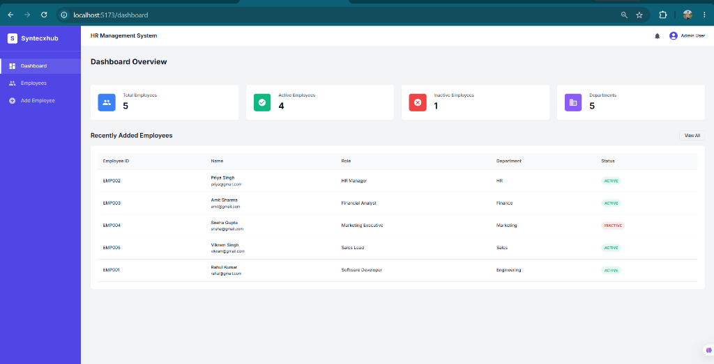
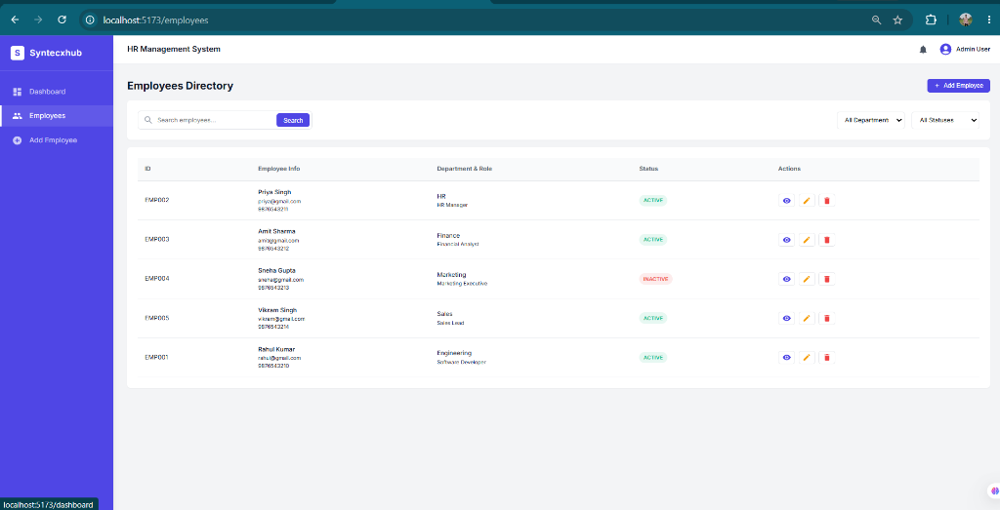
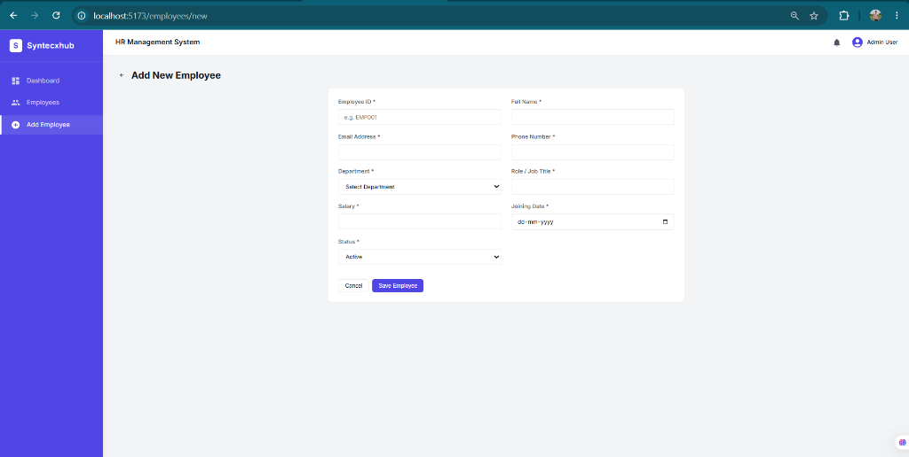

# Syntecxhub Employee Management System

This is a full-stack MERN (MongoDB, Express, React, Node.js) application built as part of the Syntecxhub Web Development Internship (Task 3, Project 3). It serves as a professional, responsive HR management dashboard for managing employee records.

## Features

- **Employee CRUD**: Complete Create, Read, Update, and Delete functionality.
- **Search & Filter**: Search employees by name, ID, email, etc., and filter by department or status.
- **Dashboard Statistics**: Dynamic calculation of total, active, and inactive employees.
- **Form Validation**: Robust frontend and backend validation for all inputs (e.g., proper email format, positive salary).
- **Responsive Design**: fully functional across mobile, tablet, and desktop views.
- **Employee Details View**: A dedicated, clean profile view for each employee.
- **Error Handling**: Graceful error UI and robust backend API error handling.

## Tech Stack

- **Frontend**: React.js (Vite), React Router, Axios, React Icons, Vanilla CSS
- **Backend**: Node.js, Express.js, Mongoose
- **Database**: MongoDB

## Project Structure

```text
Syntecxhub_Employee_Management_System/
│
├── client/          # React frontend
│   ├── public/
│   ├── src/
│   │   ├── components/
│   │   ├── pages/
│   │   ├── services/
│   │   └── App.jsx
│   └── package.json
│
├── server/          # Node.js backend
│   ├── config/
│   ├── controllers/
│   ├── middleware/
│   ├── models/
│   ├── routes/
│   ├── server.js
│   └── package.json
│
├── .gitignore
└── README.md
```

## Installation

1. Clone the repository or navigate to the project directory.

2. Install backend dependencies:
```bash
cd server
npm install
```

3. Install frontend dependencies:
```bash
cd client
npm install
```

## Environment Variables

Create a `.env` file in the `server` directory (you can copy from `.env.example`):

```env
PORT=5000
MONGO_URI=mongodb://localhost:27017/employee-management
NODE_ENV=development
```

## Seeding Sample Data

To populate the database with sample employees for testing:
```bash
cd server
npm run seed
```
*(Note: Ensure you add `"seed": "node seed.js"` to your server `package.json` scripts, or just run `node seed.js` directly).*

## Running the Project

1. Start the backend server (from the `server` directory):
```bash
npm start
# or for development with nodemon:
npm run dev
```

2. Start the frontend application (from the `client` directory):
```bash
npm run dev
```

The application will typically be available at `http://localhost:5173/`.

## API Endpoints

- `GET    /api/employees` - Get all employees (supports `?search=`, `?department=`, `?status=` queries)
- `GET    /api/employees/:id` - Get a single employee by MongoDB ID
- `POST   /api/employees` - Create a new employee
- `PUT    /api/employees/:id` - Update an existing employee
- `DELETE /api/employees/:id` - Delete an employee

## Screenshots

### Dashboard


### Employees Directory


### Add New Employee


## Future Improvements

- Authentication (Admin Login / JWT)
- Role-based access control
- Payroll and Leave management modules
- Employee attendance tracking
- Export reports to CSV/PDF
