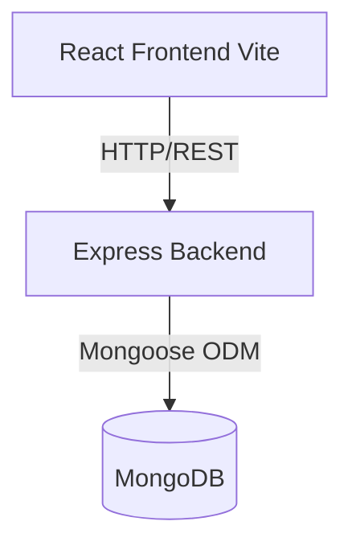

# Detailed Project Report: Employee Management System

## 1. Project Overview
The **Employee Management System** is a full-stack web application. It provides a robust, professional, and user-friendly interface for HR personnel to manage employee records. The system facilitates complete CRUD (Create, Read, Update, Delete) operations with extensive search, filtering, and data validation capabilities.

## 2. Technology Stack
The application is built upon the MERN stack, chosen for its high performance, scalability, and seamless integration between frontend and backend environments using JavaScript.

### Frontend
- **React 18**: Core UI library.
- **Vite**: Ultra-fast build tool and development server.
- **React Router DOM**: Client-side routing for seamless page navigation.
- **Axios**: Promise-based HTTP client for making API requests to the backend.
- **React Hot Toast**: Beautiful, non-blocking toast notifications for user feedback.
- **React Icons**: Scalable vector icons.
- **Vanilla CSS**: Custom styling with a focus on modern design, flexbox, and responsiveness.

### Backend
- **Node.js**: JavaScript runtime environment.
- **Express.js**: Fast, unopinionated web framework for Node.js.
- **Mongoose**: Elegant MongoDB object modeling for Node.js.
- **Cors**: Middleware to enable Cross-Origin Resource Sharing.
- **Dotenv**: Zero-dependency module that loads environment variables.

### Database
- **MongoDB**: NoSQL document database for flexible and scalable data storage.

---

## 3. System Architecture
The project follows a standard client-server architecture:

### Directory Structure highlights
- `client/src/components/`: Reusable UI components (Sidebar, Navbar, EmployeeForm, SearchBar, DeleteModal).
- `client/src/pages/`: Main application views (Dashboard, Employees, AddEmployee, EditEmployee, EmployeeDetails).
- `client/src/services/`: API integration layer (`employeeService.js`) handling all backend communication.
- `server/models/`: Mongoose schemas defining database structure.
- `server/controllers/`: Core business logic and request handling.
- `server/routes/`: API endpoint definitions and routing.
- `server/middleware/`: Custom middleware (e.g., centralized error handling).

---

## 4. Key Features & Functionality

### Dashboard & Analytics
- Real-time overview of critical metrics: Total Employees, Active Employees, Inactive Employees, and Department count.
- Quick access to recently added employees.

### Employee Directory
- Responsive data table presenting employee information.
- **Search**: Search by Employee ID, Name, Email, or Phone.
- **Filters**: Filter by Department or Status.

### Employee Lifecycle Management
- **Add**: Form with strict validation (e.g., 10-digit phone number, positive salary, valid email).
- **Edit**: Pre-populated forms allowing updates to existing records.
- **View**: A dedicated profile page displaying comprehensive employee details.
- **Delete**: Safe deletion protected by a confirmation modal to prevent accidental data loss.

### User Experience (UX) Enhancements
- **Responsive Design**: The UI gracefully degrades on mobile devices. The standard data table converts into vertical cards on screens smaller than 768px.
- **Loading States**: Visual feedback during data fetching and form submissions.
- **Toast Notifications**: Professional, non-intrusive success and error messages replacing default browser alerts.

---

## 5. Database Schema
The MongoDB database uses a single, robust `Employee` collection defined by Mongoose:

| Field | Type | Constraints | Description |
| :--- | :--- | :--- | :--- |
| `employeeId` | String | Required, Unique | The unique company identifier (e.g., EMP001). |
| `name` | String | Required | The employee's full name. |
| `email` | String | Required, Unique, Regex | The employee's email address (must be valid format). |
| `phone` | String | Required, Regex | The employee's contact number (must be exactly 10 digits). |
| `department` | String | Required | The department (Engineering, HR, etc.). |
| `role` | String | Required | The employee's job title. |
| `salary` | Number | Required, Min: 0 | The employee's salary (cannot be negative). |
| `joiningDate` | Date | Required | The date the employee joined the company. |
| `status` | String | Enum (Active, Inactive) | The current employment status. |

*Timestamps (`createdAt`, `updatedAt`) are automatically managed by Mongoose.*

---

## 6. API Endpoints

The Express backend exposes a RESTful API:

### `GET /api/employees`
- **Description**: Retrieves a list of all employees.
- **Query Parameters**: `search` (String), `department` (String), `status` (String).
- **Response**: `200 OK` with an array of employee objects.

### `GET /api/employees/:id`
- **Description**: Retrieves a single employee by their MongoDB ObjectId.
- **Response**: `200 OK` with the employee object, or `404 Not Found`.

### `POST /api/employees`
- **Description**: Creates a new employee record.
- **Body**: Requires all mandatory fields defined in the schema.
- **Response**: `201 Created` with the new employee object, or `409 Conflict` if the `employeeId` or `email` already exists.

### `PUT /api/employees/:id`
- **Description**: Updates an existing employee record.
- **Body**: The fields to update.
- **Response**: `200 OK` with the updated employee object.

### `DELETE /api/employees/:id`
- **Description**: Deletes an employee record.
- **Response**: `200 OK` with a success message.

---

## 7. Recent Improvements & Refactoring
The following improvements were recently implemented to elevate the project to a professional standard:

1. **Centralized Error Handling**: A custom `errorMiddleware` was introduced in the backend to intercept Mongoose validation and cast errors, converting them into clean, human-readable messages for the frontend.
2. **Environment Variable Security**: Hardcoded API URLs (`http://localhost:5000`) were removed from the frontend and replaced with a `VITE_API_URL` environment variable.
3. **Data Integrity**: Enforced strict regex validation for phone numbers (10 digits) directly at the database level.
4. **Mobile Responsiveness**: The desktop-only table layout was refactored using CSS media queries to display mobile-friendly cards on smaller viewports.
5. **Modern Feedback**: Replaced all jarring `window.alert()` and `window.confirm()` calls with a custom `DeleteModal` and `react-hot-toast` notifications.

## 8. Conclusion
The Employee Management System provides a clean, responsive, and robust solution for basic HR management, utilizing best practices in MERN stack development, API design, and user experience.
